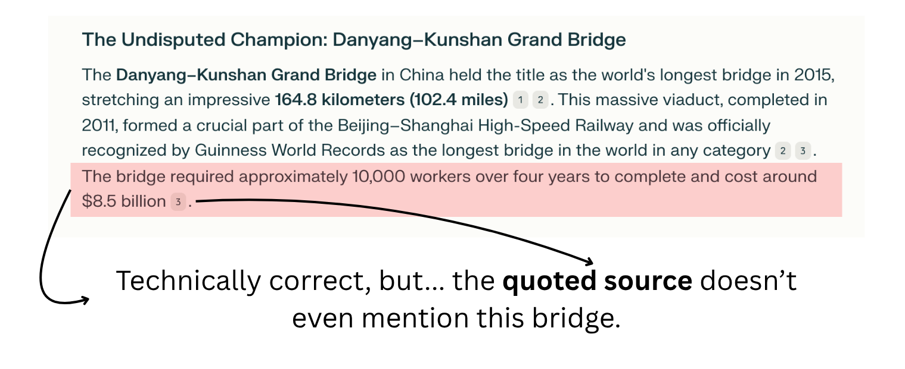
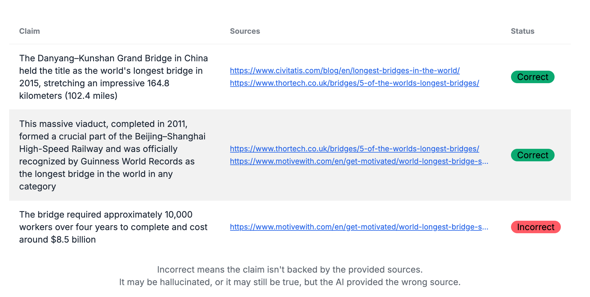

# [Lǎoshǔ.ai](https://laoshu.ai)


Expose AI Citation Fakes Instantly

LLMs bluff. You get blamed. **Laoshu.ai** slams the brakes on fake citations so you ship only the truth.

---

## Fake Citations Kill Trust

One slip, and your credibility's gone.

### Without Laoshu.ai



### With Laoshu.ai



---

## Why Trust Laoshu.ai?

- **Catch** fake citations before they catch you.
- **Ship** with confidence. No more AI lies.
- **Open-source** ([AGPL](https://www.gnu.org/licenses/agpl-3.0.html)), zero black box.
- **Self-hosted**, your keys, your data.

---

## How Laoshu.ai Works

1. Paste any output from Perplexity/ChatGPT Deep Research.
2. Laoshu fetches every source.
3. Get instant pass/fail verdicts.

---

## Get Laoshu.ai

> ⚠️ **Warning:** This is an early proof-of-concept release. It more or less works with Perplexity outputs.

Run Laoshu.ai with Docker:

```sh
docker run -p 3000:3000 -e SCRAPINGANT_API_KEY=your_key -e OPENAI_API_KEY=your_key mikulskibartosz/laoshu:latest
```

Open your browser at [http://localhost:3000](http://localhost:3000), drop text, get the verdict.

Bring your own [ScrapingAnt](https://scrapingant.com/) & [OpenAI](https://platform.openai.com/settings/organization/api-keys) keys.

---

## Contributing

Contributions are welcome! For now, we're accepting feature requests and bug reports, but not code contributions yet.

- **Feature requests:** Open an issue and describe what you'd like to see
- **Bug reports:** Include steps to reproduce and expected vs actual behavior
- **Documentation:** Typos, clarifications, and improvements are appreciated

We'll open up code contributions once the core functionality is more stable.

And once there are "we", for now it's a single person project ;)

---

## Source Code & Author

Source code: [https://github.com/mikulskibartosz/laoshu](https://github.com/mikulskibartosz/laoshu)

Built by **[Bartosz Mikulski](https://www.linkedin.com/in/mikulskibartosz)** — AI hallucination-prevention specialist. Need custom fixes? [Let's talk.](https://mikulskibartosz.name)

---

## License

Lǎoshǔ.ai is released under the GNU Affero General Public License v3.0. Commercial entities wishing to use it under a different license should contact me.